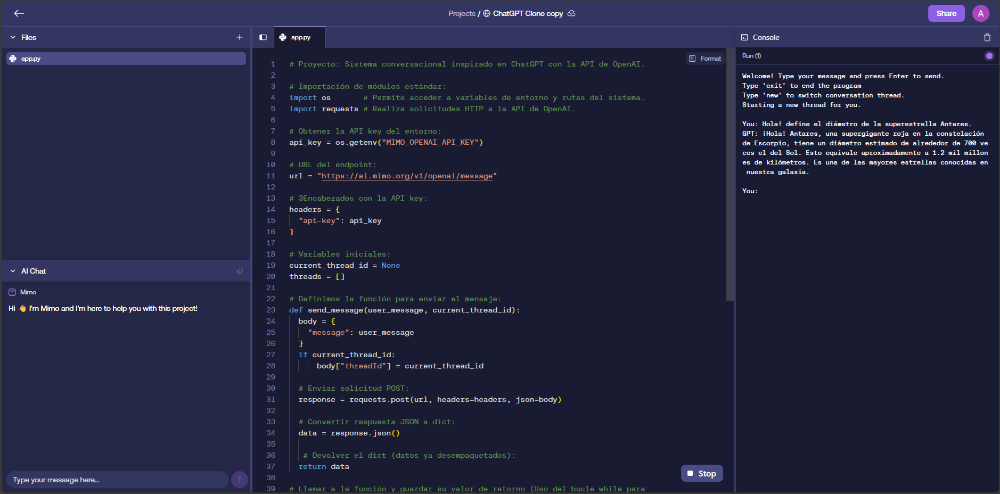
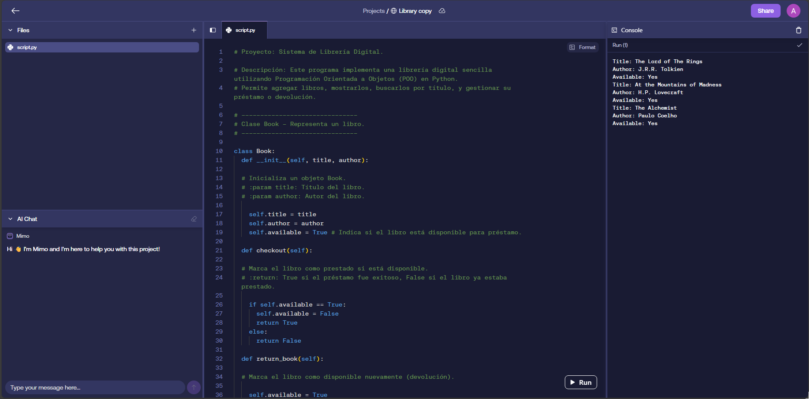
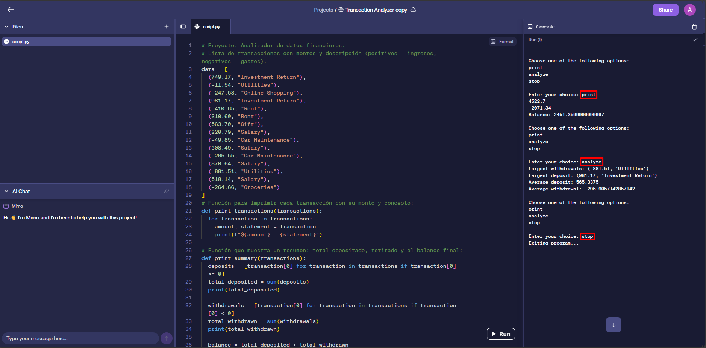
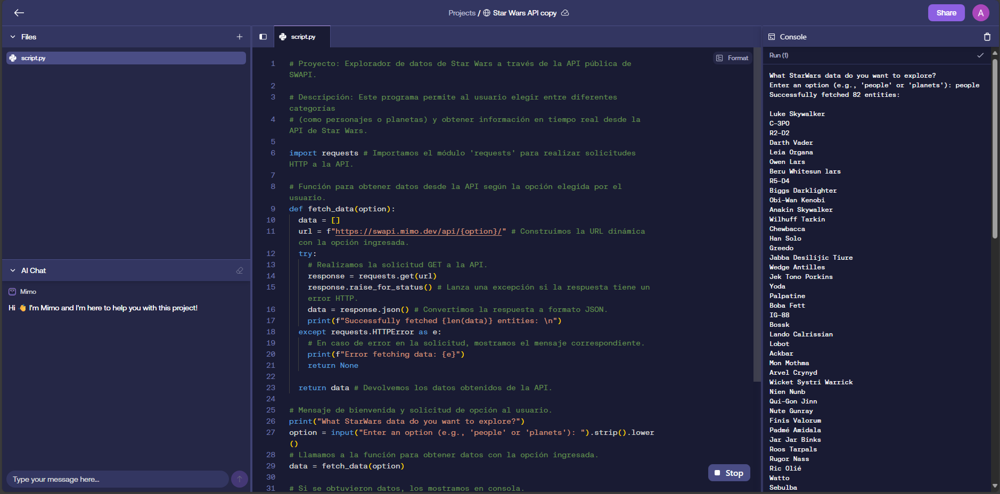
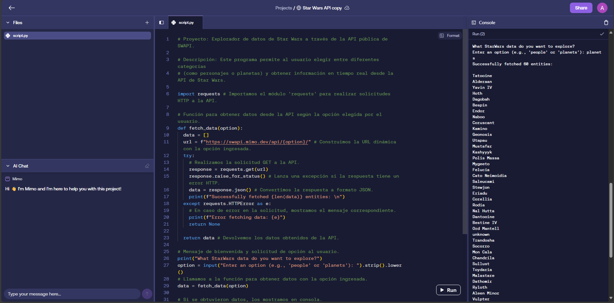

# Proyectos Python (Mimo, Plataforma de formación online)

Este repositorio contiene una colección de proyectos realizados durante mi formación en Python, aplicando desde conceptos básicos hasta el consumo de APIs y programación estructurada. 
Cada proyecto representa un paso en mi proceso de aprendizaje y demuestra mi capacidad para resolver problemas con código limpio y funcional.

---

# Lista de proyectos:

# 1. ChatGPT Clone
- Descripción: Sistema conversacional con múltiples hilos de diálogo desarrollado a partir de la API de OpenAI.
- Conceptos aplicados: Programación en Python, uso de la API de OpenAI, manejo de solicitudes HTTP con 'requests', 
                       manipulación de datos en formato JSON, uso del módulo 'os', estructuras de control de flujo,
		       entrada/salida por consola (CLI) y modularización de funciones.
- Archivo: `ChatGPT_Clone.py`

---

# 2. Biblioteca Digital.
- Descripción: Simula un sistema de gestión de libros usando Programación Orientada a Objetos.
- Conceptos aplicados: clases, objetos, encapsulamiento, listas y diccionarios.
- Archivo: `Librería_Digital.py`

---

# 3. Motor de Análisis Financiero.
- Descripción: Sistema de análisis financiero que procesa transacciones para calcular ingresos, egresos, balance total, promedios y movimientos
	       más representativos. Incluye un menú interactivo para imprimir el resumen o analizar datos en detalle.
- Conceptos aplicados: Programación en Python, listas y comprensión de listas, funciones, estructuras de control de flujo, iteración con bucles,
		       manipulación de datos numéricos, entrada por consola (CLI) y ordenamiento de datos.

- Archivo: `Analizador_de_Datos_Financieros.py`

---

# 4. Explorador de API de Star Wars.
- Descripción: Conecta con la API pública de Star Wars y muestra información sobre personajes o planetas.
- Conceptos aplicados: uso de módulos, peticiones HTTP con `requests`, estructuras de control.
- Archivo: `Explorador_de_Datos_de_Star_Wars_con_API_REST.py`

---

# 5. Simulador de Mazo de Cartas.
- Descripción: Genera un mazo completo de 52 cartas, lo baraja aleatoriamente, extrae cartas por turnos y las 
	       muestra en formato ASCII en la terminal.
- Conceptos aplicados: bucles, tuplas, listas, funciones, librería `random`.
- Archivo: `Simulador_de_Mazo_de_Cartas.py`

Imagenes/Simulador_de_Mazo_de_Cartas_Código_Ejecutado.png

---

# 6. Evaluador de contraseñas seguras.
- Descripción: Genera y reparte cartas de forma aleatoria utilizando tuplas y listas.
- Conceptos aplicados: bucles, tuplas, listas, funciones, librería `random`.
- Archivo: `Evaluador_de_ Contraseñas_ Seguras.py`

Imagenes/Evaluador_de_Contraseñas_seguras_Código_Ejecutado.png

---

# Tecnologías utilizadas:
- Lenguaje: Python 3.x -> Nota: La versión exacta de Python utilizada en el entorno de Mimo no está especificada públicamente, 
				pero se basa en Python 3.x compatible con las librerías mencionadas.
- Librerías: `requests`, `random`, `os`  
- Programación estructurada y orientada a objetos  
- Interacción con APIs REST  
- Entrada/salida por consola (CLI)

---

# Contacto
Si deseas conocer más sobre mis proyectos o colaborar:

- 💼 [LinkedIn](https://linkedin.com/in/tu-usuario)
- 💻 [GitHub](https://github.com/tu-usuario)

